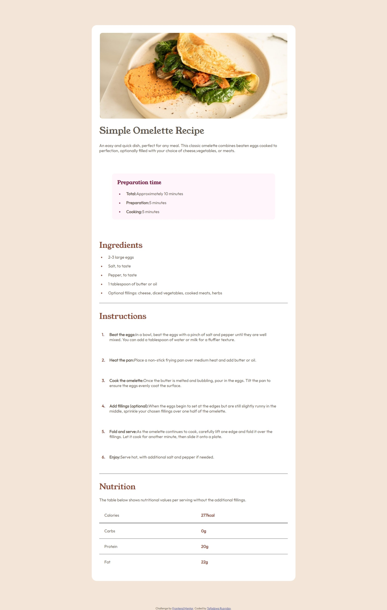

# Frontend Mentor - Recipe page solution

This is a solution to the [Recipe page challenge on Frontend Mentor](https://www.frontendmentor.io/challenges/recipe-page-KiTsR8QQKm). Frontend Mentor challenges help you improve your coding skills by building realistic projects. 

## Table of contents

- [Overview](#overview)
  - [The challenge](#the-challenge)
  - [Screenshot](#screenshot)
  - [Links](#links)
- [My process](#my-process)
  - [Built with](#built-with)
  - [What I learned](#what-i-learned)
  - [Continued development](#continued-development)
  - [Useful resources](#useful-resources)
- [Author](#author)

## Overview

### Screenshot

### Links

- Solution URL: [Add solution URL here](https://your-solution-url.com)
- Live Site URL: [Add live site URL here](https://your-live-site-url.com)

## My process

### Built with

- Semantic HTML5 markup
- CSS custom properties
- Flexbox
- Mobile-first workflow

### What I learned

In this project I learn how to use CSS ::before pseudo element to put list bullets of diffent color than list items.
I also learned more about CSS flexbox and media quaries.

### Continued development

I will continueo to improve on accebility as I go on.

### Useful resources

- [w3schools](https://www.w3schools.com) - This is good for all web develoment realated resources.

## Author

- Website - [Add your name here](https://www.your-site.com)
- Frontend Mentor - [@Taffy-R](https://www.frontendmentor.io/profile/Taffy-R)
- Twitter - [@tafadzwaruzvidz](https://www.twitter.com/tafadzwaruzvidz)

